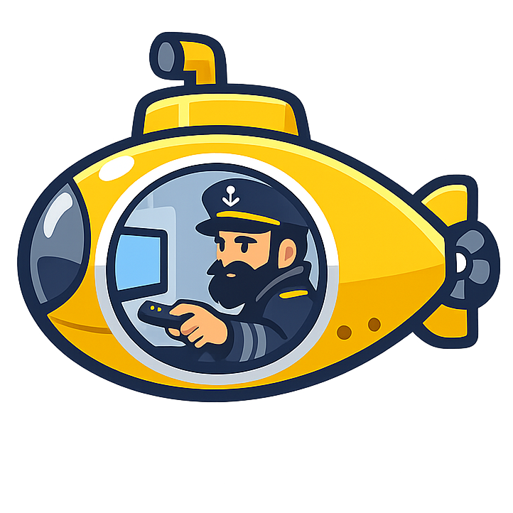
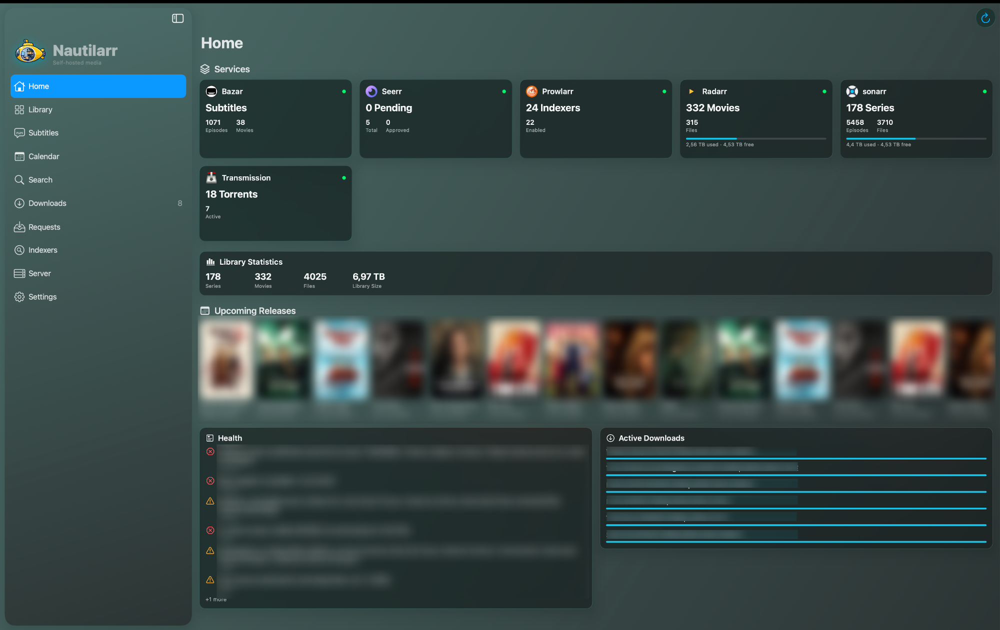
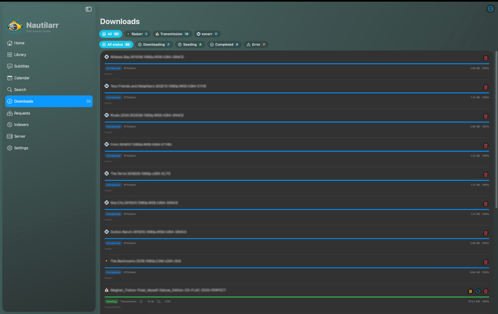
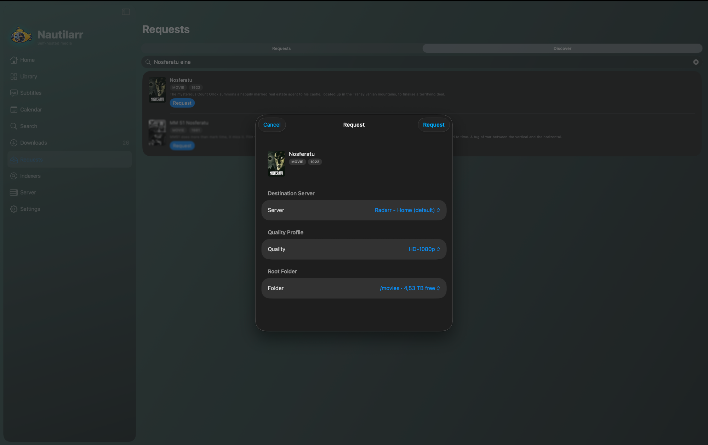
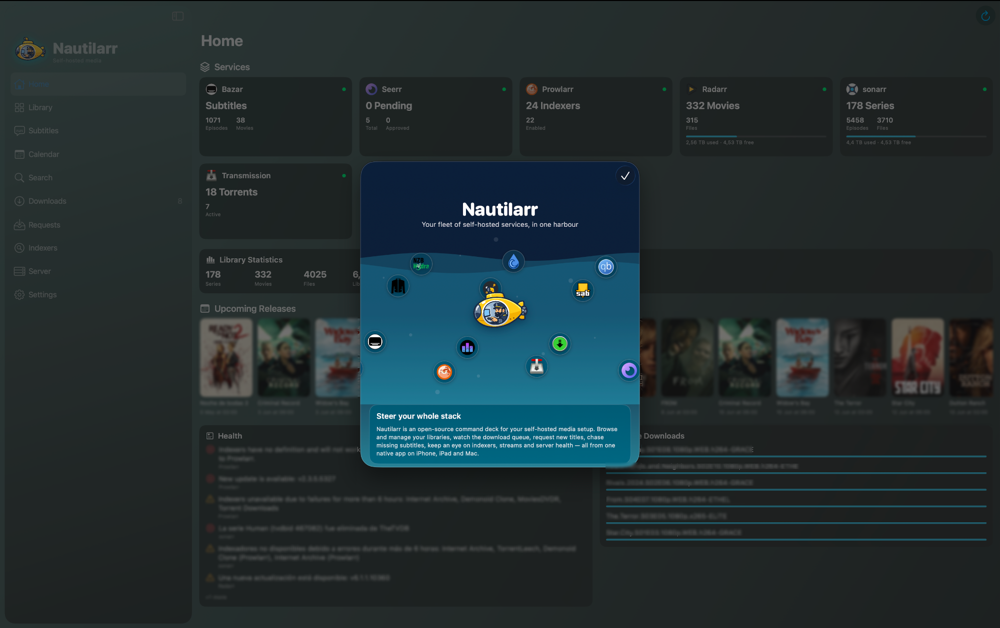
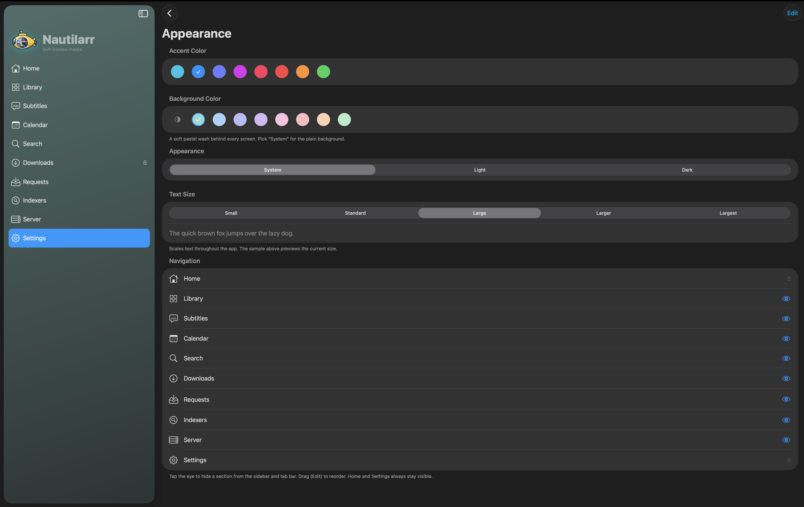
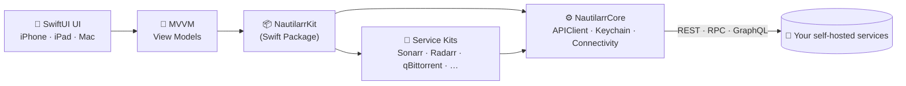

<div align="center">



# Nautilarr

**Your whole self-hosted media stack — in one native app.**

Manage your *arr services, download clients, requests, subtitles, indexers and
servers from a single adaptive app for **iPhone, iPad and Mac**, built entirely
against each service's public REST API.

[](https://github.com/drakonis96/nautilarr/actions/workflows/ci.yml)
[](LICENSE)


</div>

---

## ✨ Screenshots

<table>
  <tr>
    <td width="50%"><br/><sub><b>Dashboard</b> — per-service stat cards, upcoming releases, health & active downloads</sub></td>
    <td width="50%"><br/><sub><b>Library</b> — unified poster grid with Series / Movies filters and search</sub></td>
  </tr>
  <tr>
    <td width="50%"><br/><sub><b>Downloads</b> — per-service tabs, status filters, inline controls & seed stats</sub></td>
    <td width="50%"><br/><sub><b>Unified requests</b> — pick server, quality profile & root folder, just like the source</sub></td>
  </tr>
  <tr>
    <td width="50%"><br/><sub><b>About</b> — the Nautilarr sub sailing past the services it can connect</sub></td>
    <td width="50%"><br/><sub><b>Theming</b> — accent colours, pastel backgrounds, text size & navigation</sub></td>
  </tr>
</table>

---

## 🚀 What is Nautilarr?

Nautilarr is an open-source **command deck** for a self-hosted media setup. Instead
of juggling a dozen web UIs, you get one fast, native app that talks to all of
them and presents everything — libraries, the download queue, requests, missing
subtitles, indexers, streams and server health — in a single, consistent place.

- **One app, three platforms.** A single SwiftUI codebase for iPhone, iPad and
  macOS (via Mac Catalyst). Adaptive layout: a tab bar on iPhone, a sidebar +
  detail split on iPad and Mac.
- **No paid Apple Developer account required.** Distributed for iOS/iPadOS via
  AltStore using a free Apple ID, and for macOS as an ad-hoc-signed `.app`.
- **Secure & private.** API keys and passwords live in the system Keychain,
  never in plain storage. No analytics, no telemetry — the app only talks to the
  services *you* configure.

## 🧩 Features

| | |
| --- | --- |
| 🏠 **Dashboard** | Per-service stat cards (counts · files · library size · disk usage), currently-playing streams, an upcoming-releases poster carousel and aggregate library stats. |
| 🎬 **Library** | Unified poster grid across Sonarr / Radarr / Lidarr, with filters, sort, adjustable columns, rich detail views, season/episode monitoring and interactive search. |
| ⬇️ **Downloads** | One queue across every *arr import list and download client, split by **service tabs** and **status filters** (downloading · seeding · completed · paused · error), with inline play/pause/recheck/remove, seed time & ratio, and an optional **seed-time limit** janitor. |
| 🎟️ **Requests** | Browse & request titles through Overseerr / Jellyseerr with the **same advanced options as the source** — destination server, quality profile, root folder, language and per-season selection. |
| 💬 **Subtitles** | Bazarr "wanted" lists with one-tap search **per missing language**, provider results ranked by score, and download. |
| 🗂️ **Indexers** | Prowlarr search, indexer enable/disable and test. |
| 🖥️ **Server tools** | SSH terminal, host stats and an SFTP file browser, plus Docker start/stop over SSH — with optional **Face ID** gating. |
| 📅 **Calendar** | A day-grouped release timeline with downloaded / missing / upcoming status. |
| 🎨 **Looks** | Apple's **Liquid Glass** material on iOS / macOS 26+, selectable accent colours, **pastel background washes**, light/dark themes and an app-wide text-size control. |
| 🌐 **Networks** | Multiple instances per service, each with a primary (LAN) and fallback (WAN) host — Nautilarr picks the right one automatically, with manual override and custom HTTP headers. |
| 🔔 **Notifications** | Local notifications + background polling for grabs, imports, health warnings, requests and new streams. |
| 🔁 **Backup** | Import / export your whole configuration as JSON. |

## 🔌 Supported services

Each integration talks to the service's own documented, public REST / RPC / GraphQL
API. Nautilarr is **not affiliated with any of these projects** — links go to their
official websites and repositories so you can install and configure them yourself.

| Service | Category |
| --- | --- |
| [Sonarr](https://sonarr.tv) · [Radarr](https://radarr.video) · [Lidarr](https://lidarr.audio) | Media management (TV · Movies · Music) |
| [Overseerr](https://overseerr.dev) / [Jellyseerr](https://github.com/fallenbagel/jellyseerr) | Requests |
| [qBittorrent](https://www.qbittorrent.org) · [Transmission](https://transmissionbt.com) · [Deluge](https://deluge-torrent.org) | Downloads (torrents) |
| [SABnzbd](https://sabnzbd.org) · [NZBGet](https://nzbget.com) | Downloads (usenet) |
| [Prowlarr](https://prowlarr.com) · [NZBHydra2](https://github.com/theotherp/nzbhydra2) · [Jackett](https://github.com/Jackett/Jackett) | Indexers |
| [Bazarr](https://www.bazarr.media) | Subtitles |
| [Tautulli](https://tautulli.com) · [Jellystat](https://github.com/CyferShepard/Jellystat) | Monitoring (active streams) |
| [Unraid](https://unraid.net) | Server stats + Docker (GraphQL) |
| SSH / SFTP | Terminal · host stats · file browser |

Shortcut launchers (open the app/web, no API access): [Plex](https://www.plex.tv) · [Jellyfin](https://jellyfin.org).

## 🏗️ Architecture



All service and networking logic lives in the **`NautilarrKit`** Swift Package, so
it can be unit-tested with `swift test` independently of the UI.

```
nautilarr/
├── project.yml                 # XcodeGen project definition (single app target)
├── App/
│   ├── Sources/
│   │   ├── App/                # @main, AppEnvironment, adaptive RootView
│   │   ├── Shared/             # stores, settings, notifications, background refresh
│   │   ├── DesignSystem/       # theme, Liquid Glass, cached images, components
│   │   └── Features/           # Home · Library · Downloads · Requests · Server · Settings · About
│   └── Resources/              # original icon/palette assets, generated Info.plist
├── Packages/
│   └── NautilarrKit/           # platform-agnostic, unit-tested logic (Swift Package)
│       ├── Sources/
│       │   ├── NautilarrCore/  # APIClient, models, Keychain, connectivity, image cache
│       │   └── <Service>Kit/   # one target per service (Sonarr, Radarr, qBittorrent, …)
│       └── Tests/              # APIClient, failover, credential & per-service fixture tests
├── Scripts/                    # IPA/app packaging + AltStore source generation
└── .github/workflows/          # CI (build + test) and Release (IPA/app + Pages)
```

- **MVVM** with `ObservableObject` view models.
- **Networking:** `async/await` over `URLSession`; one generic `APIClient` with
  host failover, pluggable authentication, custom headers and normalised errors.
- **Connectivity:** `NWPathMonitor` chooses LAN vs. WAN per request.

## 🛠️ Building from source

Requirements: macOS with **Xcode 16+** and **[XcodeGen](https://github.com/yonaskolb/XcodeGen)**
(`brew install xcodegen`).

```bash
# 1. Run the unit tests (no Xcode project needed)
cd Packages/NautilarrKit && swift test && cd -

# 2. Generate the Xcode project (it is git-ignored — always regenerate)
xcodegen generate

# 3. Open it
open Nautilarr.xcodeproj
```

> The `.xcodeproj` and `App/Resources/Info.plist` are **generated** from
> `project.yml` and are git-ignored — always run `xcodegen generate` after a
> fresh checkout. Set your own signing team in Xcode when running on a device.

Command-line build (Mac Catalyst):

```bash
xcodebuild -project Nautilarr.xcodeproj -scheme Nautilarr \
  -destination 'platform=macOS,variant=Mac Catalyst' build
```

## 📲 Installation

### iPhone / iPad — via AltStore

Nautilarr ships an **unsigned IPA**; AltStore re-signs it on your device with
your free Apple ID. Apps signed this way **expire after 7 days** and must be
refreshed (AltStore can do this automatically on the same network as AltServer).

1. Install [AltStore](https://altstore.io) and AltServer (free).
2. In AltStore, open **Browse → Sources → Add Source** and paste:
   ```
   https://drakonis96.github.io/nautilarr/apps.json
   ```
3. Find **Nautilarr** in the source and tap **Get / Install**.
4. Sign in with a free Apple ID when prompted, and enable background refresh.

### Mac — via the signed `.app`

The Mac build is distributed as an ad-hoc-signed app on the Releases page.

1. Download `Nautilarr-macOS-<version>.zip` from the latest
   [release](https://github.com/drakonis96/nautilarr/releases) and unzip it.
2. Move **Nautilarr.app** to `/Applications`.
3. First launch is blocked by Gatekeeper (the app is not notarised). Authorise once:
   - Right-click the app → **Open** → **Open**; **or**
   - From Terminal: `xattr -dr com.apple.quarantine /Applications/Nautilarr.app`

## 🔒 Security & privacy

- Secrets are stored in the **Keychain** (this-device-only, after first unlock),
  never in `UserDefaults` or the exported instance list.
- Relaxed TLS validation for self-signed certificates is **opt-in per instance**
  and scoped to that instance's hosts.
- **Push notifications while the app is closed are not possible** with
  free-certificate distribution; Nautilarr uses local notifications + background
  polling only.
- The app makes **no analytics or telemetry calls**.

## 🤝 Contributing

Contributions are welcome! A good change usually looks like:

1. **New service?** Add it as its own target under `Packages/NautilarrKit/Sources/`,
   following the existing `APIClient` + authorizer pattern, with **fixture-backed
   unit tests**.
2. Keep UI in `App/Sources/Features/` and logic in `NautilarrKit` so it stays
   testable with `swift test`.
3. Run `swift test` and a Mac Catalyst build before opening a PR.

See [CONTRIBUTING.md](CONTRIBUTING.md) for the full guidelines.

## 🗺️ Roadmap

- ✅ Sonarr · Radarr · Lidarr, requests, full download-client suite
- ✅ Tautulli · Prowlarr · Bazarr · SSH/SFTP · Jellystat · Unraid · indexers
- ✅ Liquid Glass redesign, pastel themes, animated About, seed-time limits,
  advanced unified requests
- 🔜 Live host charts, Unraid Docker mutations, additional languages

## 📄 License

[MIT](LICENSE) © 2026 drakonis96.

## ⚖️ Disclaimer & legal

**Nautilarr is a management client — nothing more.** It does not host, store,
download, distribute, index, search for or stream any media itself. It is a remote
control for self-hosted services that **you** own and operate, talking to them only
through their own publicly documented APIs. No content of any kind ships with the
app.

**Nautilarr does not endorse, encourage or facilitate copyright infringement or
piracy in any form.** The app exists to make managing your own infrastructure
easier and has substantial legitimate uses — organising media you own or have
created, public-domain works, Linux distributions and any content you are legally
entitled to access. **You alone are responsible** for the content you manage and
for complying with the laws of your jurisdiction and the terms of every service,
network and indexer you choose to connect.

**Nautilarr is an independent, original project and is not affiliated with,
endorsed by, sponsored by, or derived from any of the services it connects to.**
All product names, logos and trademarks are the property of their respective owners
and are used solely to describe interoperability. Links to each project's official
website or repository are in the [Supported services](#-supported-services) table
above. All artwork, naming and design are original to Nautilarr.
